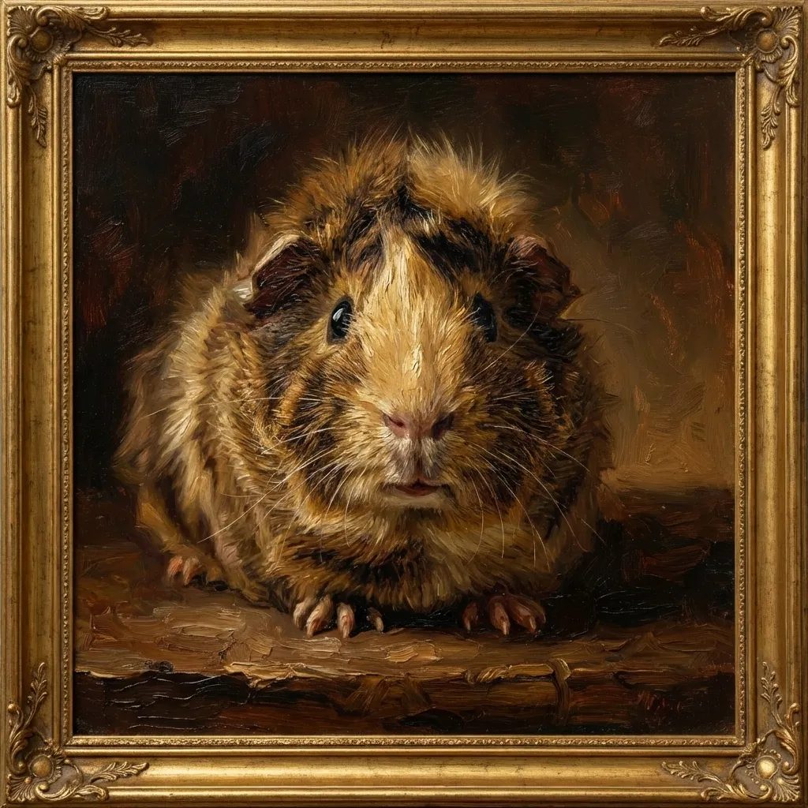
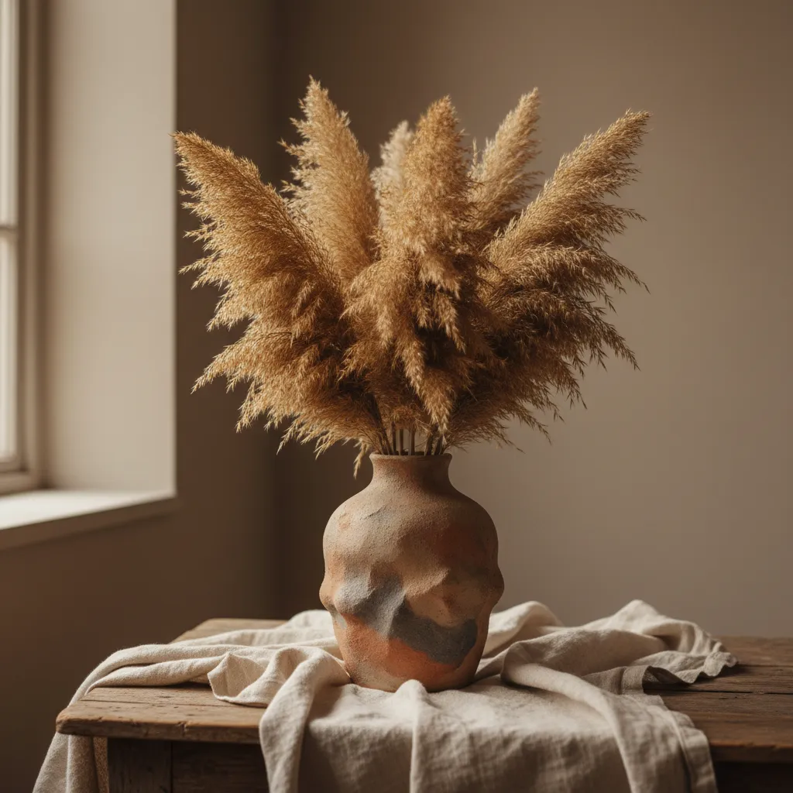

<p align="center">
  
</p>

<h1 align="center">Lunery Lab Studio</h1>

<p align="center">
  <strong>Make images. Shape ideas. Keep the work yours.</strong><br />
  A local-first, open-source desktop Studio for AI image and video creation.
</p>

<p align="center">
  <a href="https://github.com/mike007jd/lunerylab-studio/releases"><strong>Download the desktop app</strong></a>
  &nbsp;·&nbsp;
  <a href="#how-it-flows">See the workflow</a>
  &nbsp;·&nbsp;
  <a href="#build-locally">Build locally</a>
</p>

<p align="center">
  <a href="https://github.com/mike007jd/lunerylab-studio/releases"></a>
  <a href="LICENSE"></a>
  <a href="https://github.com/mike007jd/lunerylab-studio/releases"></a>
</p>

Lunery Lab Studio is a focused creative workspace for turning an idea into an
image or video, then carrying it through refinement and organization. Use
Local AI when it fits your machine, or connect a cloud service you already use.
There is no Studio account, credit system, hosted workspace, or platform-owned
model gateway in the middle.

## Built around your creative choices

| Start where you are | Choose every connection | Keep the work close |
| --- | --- | --- |
| Discover and download compatible local models, or connect a local engine already running on your computer. | Add your own cloud API connection only when you want it, and select the model used for each capability. | Projects, media, canvases, settings, and downloaded models live in a visible folder on your machine. Keys stay in the OS keychain. |

The result is deliberately simple: no surprise model fallback, no platform
subscription layer, and no need to move a project into someone else's
workspace just to create.

## How it flows

1. **Compose a direction.** Start with a prompt, add reference images, choose
   image or video, and set the style, aspect ratio, count, or batch.
2. **Generate with intent.** Create locally or with the cloud connection and
   exact model you selected — Studio never silently chooses one for you.
3. **Keep iterating.** Send a result to Canvas, reuse it as a reference, and
   organize the finished work in your Library and projects.

<table>
  <tr>
    <td width="33%"></td>
    <td width="33%"></td>
    <td width="33%"></td>
  </tr>
</table>

<p align="center"><em>Built-in sample projects give every new local workspace a starting point.</em></p>

## A Studio, not a model picker

The composer keeps the creative decision in front: prompt, references, format,
style, and generation controls live together. Recent results remain close so
you can compare, branch, or carry one forward.

When a project needs a different tool, Settings stays out of the way until you
need it. Studio can recommend a local image model for the computer, show its
readiness, and let you add an optional cloud connection without sending keys to
a platform gateway.


## Download

Get the current installers and checksums from
[GitHub Releases](https://github.com/mike007jd/lunerylab-studio/releases).

| Platform | Release asset |
| --- | --- |
| macOS (Apple Silicon) | `Lunery-Lab-Studio-macOS-arm64.dmg` — signed and notarized |
| Windows (x64) | `Lunery-Lab-Studio-Windows-x64.exe` — CPU inference |

Every release includes `SHA256SUMS.txt` so you can verify the installer before
opening it. Studio stores its workspace at `~/.lunerylab/studio`; local models
may need tens of gigabytes. **Settings → Workspace Data** backs up projects,
images, canvases, and settings. Downloaded models and OS-keychain secrets are
intentionally excluded.

## Build locally

```bash
cd my-app
pnpm install
cp .env.example .env.local
pnpm prisma:generate
pnpm desktop:dev
```

You need Node.js `>=22.23.1`, pnpm `>=10`, and Rust for the Tauri desktop
shell. Desktop uses embedded PGlite, so no external Postgres is required. For
the full setup and verification flow, read
[Developer Setup](docs/DEV_SETUP.md).

## Documentation and contributing

| Need | Start here |
| --- | --- |
| Set up, run, and validate Studio | [docs/DEV_SETUP.md](docs/DEV_SETUP.md) |
| Run human desktop acceptance | [docs/QA_MANUAL.md](docs/QA_MANUAL.md) |
| Find the engineering documentation | [docs/README.md](docs/README.md) |
| Understand product and engineering rules | [spec](spec) |
| Contribute a change | [.github/CONTRIBUTING.md](.github/CONTRIBUTING.md) |

Issues and pull requests are welcome. Please read the
[contribution checklist](.github/CONTRIBUTING.md) before opening one; it covers
the verification gates and product boundaries that keep Studio dependable.

## License

Licensed under the Apache License 2.0. See [LICENSE](LICENSE) and
[NOTICE](NOTICE).
