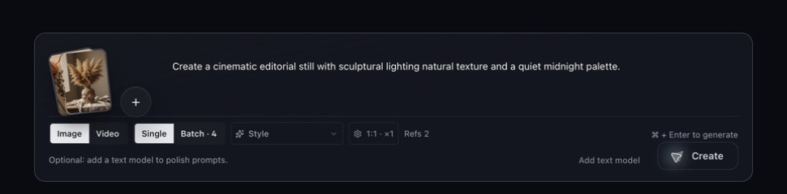
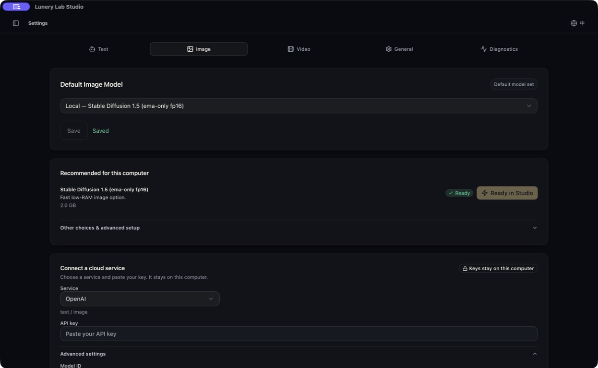

# Lunery Lab Studio

A local-first, open-source desktop Studio for AI image and video creation.
No accounts, no credits, no hosted workspace. Local projects and downloaded
models live on your machine; BYOK credentials are stored in the OS keychain,
and optional cloud requests go directly to the provider you choose.

[](https://github.com/mike007jd/lunerylab-studio/releases)
[](LICENSE)
[](https://github.com/mike007jd/lunerylab-studio/releases)



**[Download](#download) · [Documentation](#documentation) · [Build locally](#build-locally)**

## Why Lunery Lab Studio

- **Local where supported.** Run image generation with SD.cpp or ComfyUI; use
  Ollama, LM Studio, llama.cpp, MLX, or an OpenAI-compatible local endpoint
  for text and prompt workflows. Hugging Face model discovery and download are
  built into the app.
- **Cloud by choice.** Cloud image and video generation stay BYOK: select an
  available provider and model, with credentials stored in the OS keychain.
  Requests go directly to that provider, never through a platform gateway.
- **Free and open source.** Apache-2.0, single-user, and account-less. No Pro
  tier, no billing, no platform-funded model gateway.

## Inside the Studio

- **Composer** — image and video generation with single/batch modes, styles,
  aspect ratios, and reference images.
- **Model settings** — local models recommended for your hardware, plus BYOK
  cloud connections, in one place.
- **Canvas and library** — iterate on results and organize generated media.



## Download

Get the latest installers from
[GitHub Releases](https://github.com/mike007jd/lunerylab-studio/releases)
(macOS releases are signed and notarized):

- macOS (Apple Silicon): `Lunery-Lab-Studio-macOS-arm64.dmg`
- Windows (x64): `Lunery-Lab-Studio-Windows-x64.exe` (CPU inference)
- `SHA256SUMS.txt` for checksum verification

The desktop app stores its workspace under `~/.lunerylab/studio`. Local model
files can consume tens of gigabytes. **Settings → Workspace Data** backs up
projects, images, canvases, and settings; downloaded models and OS-keychain
secrets are intentionally excluded.

## Build locally

```bash
cd my-app
pnpm install
cp .env.example .env.local
pnpm prisma:generate
pnpm desktop:dev
```

Requires Node.js `>=22.23.1`, pnpm `>=10`, and Rust (for the Tauri desktop
shell). Desktop uses embedded PGlite — no external Postgres needed. The full
workflow and verification gates are in
[Developer Setup](docs/DEV_SETUP.md).

## Local-first and private

Studio runs as a desktop app (Tauri 2) with a private local server; its
workspace APIs only answer the desktop shell, and there is no browser Studio,
account system, or platform-hosted generation chain. Provider keys are stored
in the OS keychain, and your workspace — configuration, database, media, and
models — lives in a visible folder on your disk.

## Documentation

| Need | Start here |
| --- | --- |
| Setup and validation | [docs/DEV_SETUP.md](docs/DEV_SETUP.md) |
| Documentation map | [docs/README.md](docs/README.md) |
| Product and engineering rules | [spec](spec) |
| Contribution checklist | [.github/CONTRIBUTING.md](.github/CONTRIBUTING.md) |

## Contributing

Issues and pull requests are welcome. Read the
[contribution checklist](.github/CONTRIBUTING.md) first — it covers the
required verification gates and the product boundaries that are not open for
change.

## License

Licensed under the Apache License 2.0. See [LICENSE](LICENSE) and
[NOTICE](NOTICE).
